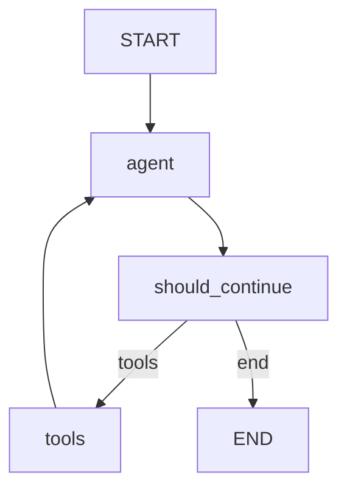

# LangGraph Agent 实现详解

## 概述

LangGraph 是 LangChain 推出的用于构建有状态、多步骤 AI 应用的框架。本文档详细说明了如何使用 LangGraph 实现标准的 ReAct（Reasoning and Acting）模式 Agent。

---

## 一、改动总览

### 1. 新增文件（1个）

```
src/
└── langgraph_agent.py    # LangGraph Agent 实现
```

### 2. 新增演示程序（1个）

```
main_langgraph.py         # LangGraph Agent 演示程序
```

### 3. 修改文件（2个）

```
- requirements.txt        # 添加 langgraph 依赖
- src/agent.py           # 增强支持多轮推理
```

---

## 二、详细改动说明

### 改动 1：添加依赖包（requirements.txt）

**新增依赖**：
```txt
langgraph>=0.0.20         # LangGraph 框架
```

**为什么需要这个包**：
- 提供状态图（StateGraph）构建能力
- 支持条件路由和循环
- 简化复杂 Agent 流程的实现

---

### 改动 2：增强原版 Agent（src/agent.py）

**新增功能**：支持多轮推理循环

**修改前**（单轮执行）：
```python
def run_agent(state, llm_with_tools, tools_map):
    # 第一次调用
    state = call_model(state, llm_with_tools)
    
    # 如果需要工具，执行一次
    if should_continue(state):
        state = execute_tools(state, tools_map)
        # 再次调用
        state = call_model(state, llm_with_tools)
    
    return state
```

**修改后**（多轮循环）：
```python
def run_agent(state, llm_with_tools, tools_map, max_iterations=10):
    """支持多轮推理的 Agent"""
    iteration = 0
    
    while iteration < max_iterations:
        iteration += 1
        
        # Step 1: 调用模型
        state = call_model(state, llm_with_tools)
        
        # Step 2: 检查是否需要继续
        if not should_continue(state):
            break
        
        # Step 3: 执行工具
        state = execute_tools(state, tools_map)
    
    return state
```

**改进点**：
- ✅ 支持多轮推理（ReAct 循环）
- ✅ 有最大迭代限制（防止死循环）
- ✅ 与 LangGraph 版本功能一致

---

### 改动 3：创建 LangGraph Agent（src/langgraph_agent.py）

#### 核心设计原则

1. **完全复用现有逻辑**：不重复实现 `call_model` 和 `execute_tools`
2. **LLM 驱动流程**：通过 `tool_calls` 决定路由，不使用关键词匹配
3. **标准 ReAct 模式**：支持 agent ↔ tools 循环
4. **状态纯净**：使用 `partial` 绑定上下文，不污染状态

#### 文件结构

```python
# 1. 节点函数
def agent_node(state, llm, tools_map):
    """Agent 节点：调用 LLM"""
    pass

def tool_node(state, tools_map):
    """工具节点：执行工具"""
    pass

# 2. 路由函数
def should_continue(state):
    """路由函数：基于 tool_calls 决定下一步"""
    pass

# 3. 图构建
def create_langgraph_agent(llm, tools_map):
    """创建 LangGraph Agent"""
    pass

# 4. 便捷函数
def run_langgraph_agent(state, llm, tools_map):
    """运行 LangGraph Agent"""
    pass
```

---

## 三、LangGraph 核心概念

### 1. 状态图（StateGraph）

**定义**：
```python
from langgraph.graph import StateGraph

workflow = StateGraph(AgentState)
```

**作用**：
- 定义 Agent 的工作流程
- 管理状态在节点间的流转
- 支持条件路由和循环

**类比**：
```
StateGraph 就像一个流程图：
- 节点 = 处理步骤
- 边 = 流程连接
- 状态 = 在节点间传递的数据
```

### 2. 节点（Node）

**定义**：
```python
def agent_node(state: AgentState, llm, tools_map) -> AgentState:
    """节点函数：输入状态，返回新状态"""
    # 处理逻辑
    return state
```

**特点**：
- 输入：当前状态
- 输出：更新后的状态
- 职责：单一、清晰

**添加节点**：
```python
workflow.add_node("agent", agent_node)
workflow.add_node("tools", tool_node)
```

### 3. 边（Edge）

**固定边**：
```python
# tools 节点执行后，总是回到 agent 节点
workflow.add_edge("tools", "agent")
```

**条件边**：
```python
# agent 节点执行后，根据条件决定下一步
workflow.add_conditional_edges(
    "agent",                    # 源节点
    should_continue,            # 路由函数
    {
        "tools": "tools",       # 如果返回 "tools"，去 tools 节点
        "end": END              # 如果返回 "end"，结束
    }
)
```

### 4. 入口点（Entry Point）

**定义**：
```python
workflow.set_entry_point("agent")
```

**作用**：指定流程的起始节点

### 5. 编译和运行

**编译**：
```python
app = workflow.compile()
```

**运行**：
```python
final_state = app.invoke(initial_state)
```

---

## 四、实现详解

### 1. Agent 节点

```python
def agent_node(state: AgentState, llm, tools_map) -> AgentState:
    """
    Agent 节点：调用 LLM 并让其决定是否使用工具
    
    完全复用 agent.py 的 call_model 逻辑
    """
    print(f"\n🤖 [Agent节点] 调用模型...")
    
    # 绑定工具到 LLM
    tools = list(tools_map.values())
    llm_with_tools = llm.bind_tools(tools)
    
    # 复用原有逻辑
    state = call_model(state, llm_with_tools)
    
    return state
```

**关键点**：
- ✅ 完全复用 `call_model`
- ✅ 不重复实现 LLM 调用逻辑
- ✅ 保留 `tool_calls` 机制

### 2. 工具节点

```python
def tool_node(state: AgentState, tools_map) -> AgentState:
    """
    工具节点：执行 LLM 决定的工具调用
    
    完全复用 agent.py 的 execute_tools 逻辑
    """
    print(f"\n🔧 [工具节点] 执行工具...")
    
    # 复用原有逻辑
    state = execute_tools(state, tools_map)
    
    return state
```

**关键点**：
- ✅ 完全复用 `execute_tools`
- ✅ 不使用 regex 或关键词解析
- ✅ 让 LLM 决定调用哪个工具

### 3. 路由函数

```python
def should_continue(state: AgentState) -> str:
    """
    路由函数：基于 LLM 的 tool_calls 决定下一步
    
    让 LLM 通过 tool_calls 驱动流程，不使用关键词匹配
    """
    # 检查是否有待执行的工具调用
    if state.get("tool_calls"):
        print(f"🔀 [Router] LLM 决定调用工具")
        return "tools"
    
    # 检查是否有最终答案
    if state.get("final_answer"):
        print(f"🔀 [Router] LLM 给出最终答案")
        return "end"
    
    # 默认继续
    print(f"🔀 [Router] 继续推理")
    return "continue"
```

**关键点**：
- ✅ 基于 `tool_calls` 判断（LLM 驱动）
- ❌ 不使用关键词匹配（如 "计算"、"华东师范"）
- ✅ 保留 AI 推理能力

**错误示例**（不要这样做）：
```python
# ❌ 错误：使用关键词匹配
def should_continue(state):
    user_message = state["messages"][0].content
    if "计算" in user_message:
        return "tools"
    # ...
```

### 4. 图构建

```python
def create_langgraph_agent(llm, tools_map):
    """创建 LangGraph Agent（标准 ReAct 模式）"""
    
    # 创建状态图
    workflow = StateGraph(AgentState)
    
    # 使用 partial 绑定上下文
    from functools import partial
    agent_with_context = partial(agent_node, llm=llm, tools_map=tools_map)
    tool_with_context = partial(tool_node, tools_map=tools_map)
    
    # 添加节点
    workflow.add_node("agent", agent_with_context)
    workflow.add_node("tools", tool_with_context)
    
    # 设置入口点
    workflow.set_entry_point("agent")
    
    # 添加条件边：agent → tools 或 END
    workflow.add_conditional_edges(
        "agent",
        should_continue,
        {
            "tools": "tools",
            "end": END,
            "continue": "agent"
        }
    )
    
    # 添加边：tools → agent（形成 ReAct 循环）
    workflow.add_edge("tools", "agent")
    
    # 编译图
    app = workflow.compile()
    
    return app
```

**流程图**：
```
START
  ↓
agent (LLM 推理)
  ↓
should_continue (检查 tool_calls)
  ├─→ tools (执行工具)
  │     ↓
  │   agent (继续推理)
  │     ↓
  │   should_continue
  │     ↓
  └─→ END (最终答案)
```

**关键点**：
- ✅ 使用 `partial` 绑定上下文（不污染状态）
- ✅ 支持循环（tools → agent）
- ✅ 条件路由（基于 `tool_calls`）

---

## 五、ReAct 模式详解

### 什么是 ReAct？

**ReAct = Reasoning（推理）+ Acting（行动）**

**核心思想**：
1. **Reasoning**：LLM 思考需要做什么
2. **Acting**：执行工具获取信息
3. **Reasoning**：基于工具结果继续思考
4. **重复**：直到得出最终答案

### ReAct 循环示例

**问题**：华东师范大学在哪里？

```
[第1轮]
Reasoning (Agent):
  "用户问华东师范大学的位置，我需要搜索知识库"
  → tool_calls: [knowledge_search("华东师范大学位置")]

Acting (Tools):
  执行 knowledge_search
  → 返回: "华东师范大学有两个校区：闵行校区和中山北路校区..."

[第2轮]
Reasoning (Agent):
  "我已经获得了信息，可以回答用户了"
  → final_answer: "华东师范大学有两个校区：..."

END
```

### 为什么需要循环？

**单轮执行的问题**：
```
问题: "请计算 (25 + 17) * 2"

单轮执行:
  Agent → calculator(25, 17) → 42
  无法继续计算 42 * 2
```

**多轮循环的优势**：
```
问题: "请计算 (25 + 17) * 2"

多轮循环:
  [第1轮] Agent → calculator(25, 17) → 42
  [第2轮] Agent → calculator(42, 2) → 84
  [第3轮] Agent → 返回答案: "84"
```

---

## 六、原版 Agent vs LangGraph Agent

### 功能对比

| 特性 | 原版 Agent | LangGraph Agent |
|------|-----------|----------------|
| 实现方式 | while 循环 | 图结构 |
| 代码复杂度 | 简单 | 中等 |
| 可视化 | 无 | 支持 |
| 扩展性 | 中等 | 高 |
| 多轮推理 | ✅ 支持 | ✅ 支持 |
| 工具调用 | ✅ tool_calls | ✅ tool_calls |
| 功能 | 完全相同 | 完全相同 |

### 代码对比

**原版 Agent**：
```python
def run_agent(state, llm_with_tools, tools_map, max_iterations=10):
    iteration = 0
    while iteration < max_iterations:
        state = call_model(state, llm_with_tools)
        if not should_continue(state):
            break
        state = execute_tools(state, tools_map)
    return state
```

**LangGraph Agent**：
```python
workflow = StateGraph(AgentState)
workflow.add_node("agent", agent_node)
workflow.add_node("tools", tool_node)
workflow.add_conditional_edges("agent", should_continue, {...})
workflow.add_edge("tools", "agent")
app = workflow.compile()
final_state = app.invoke(initial_state)
```

### 何时使用哪个？

**使用原版 Agent**：
- 简单场景
- 快速原型
- 学习 Agent 基础

**使用 LangGraph Agent**：
- 复杂流程
- 需要可视化
- 多 Agent 协作
- 生产环境

---

## 七、常见错误和最佳实践

### ❌ 错误 1：绕过 tool_calls

**错误做法**：
```python
def tool_node(state, tools_map):
    # 使用 regex 手动提取数字
    import re
    user_message = state["messages"][0].content
    numbers = re.findall(r'\d+', user_message)
    
    if len(numbers) >= 2:
        a, b = float(numbers[0]), float(numbers[1])
        result = tools_map["calculator"].invoke({"a": a, "b": b})
    # ...
```

**问题**：
- 完全绕过了 LLM 的推理
- 无法处理复杂表达（如 "25加17"）
- 失去了 AI 能力

**正确做法**：
```python
def tool_node(state, tools_map):
    # 完全复用 execute_tools
    state = execute_tools(state, tools_map)
    return state
```

### ❌ 错误 2：关键词路由

**错误做法**：
```python
def should_continue(state):
    user_message = state["messages"][0].content
    
    # 关键词匹配
    if any(keyword in user_message for keyword in ["计算", "加", "减"]):
        return "tools"
    # ...
```

**问题**：
- 关键词列表永远不完整
- 无法处理同义词
- 替代了 LLM 的推理

**正确做法**：
```python
def should_continue(state):
    # 基于 LLM 的 tool_calls 决定
    if state.get("tool_calls"):
        return "tools"
    # ...
```

### ❌ 错误 3：单向流程

**错误做法**：
```python
workflow.add_edge("tools", END)  # 执行工具后直接结束
```

**问题**：
- 不支持多轮推理
- 无法处理复杂问题

**正确做法**：
```python
workflow.add_edge("tools", "agent")  # 执行工具后回到 agent
```

### ❌ 错误 4：污染状态

**错误做法**：
```python
# 将 llm 和 tools_map 存入状态
state["_llm"] = llm
state["_tools_map"] = tools_map
```

**问题**：
- 状态包含非业务数据
- 难以序列化
- 不符合最佳实践

**正确做法**：
```python
# 使用 partial 绑定上下文
from functools import partial
agent_with_context = partial(agent_node, llm=llm, tools_map=tools_map)
```

### ✅ 最佳实践总结

1. **LLM 驱动**：让 LLM 通过 `tool_calls` 决定一切
2. **完全复用**：100% 复用现有逻辑，不重复实现
3. **支持循环**：tools → agent 形成 ReAct 循环
4. **状态纯净**：使用 `partial` 绑定上下文
5. **职责清晰**：每个节点职责单一

---

## 八、扩展和优化

### 1. 添加对话历史（Memory）

```python
from langgraph.checkpoint import MemorySaver

# 创建 memory
memory = MemorySaver()

# 编译时添加 checkpointer
app = workflow.compile(checkpointer=memory)

# 运行时指定 thread_id
config = {"configurable": {"thread_id": "user123"}}
final_state = app.invoke(initial_state, config)
```

**作用**：
- 保存对话历史
- 支持多轮对话
- 可恢复中断的对话

### 2. 添加流式输出

```python
# 同步流式
for event in app.stream(initial_state):
    print(event)

# 异步流式
async for event in app.astream(initial_state):
    print(event)
```

**作用**：
- 实时显示 Agent 思考过程
- 提升用户体验
- 便于调试

### 3. 添加人工审核节点

```python
def human_review_node(state):
    """人工审核节点"""
    if state.get("needs_review"):
        print(f"\n⚠️  需要人工审核:")
        print(f"   问题: {state['messages'][0].content}")
        print(f"   计划: {state.get('plan')}")
        
        approval = input("是否批准？(y/n): ")
        state["approved"] = approval == "y"
    
    return state

# 添加到图中
workflow.add_node("human_review", human_review_node)
workflow.add_edge("agent", "human_review")
workflow.add_conditional_edges("human_review", lambda s: "tools" if s["approved"] else "end", {...})
```

**作用**：
- 关键操作需要人工确认
- 提高安全性
- 符合合规要求

### 4. 并行工具执行

```python
from concurrent.futures import ThreadPoolExecutor

def tool_node_parallel(state, tools_map):
    """并行执行多个工具"""
    tool_calls = state.get("tool_calls", [])
    
    if not tool_calls:
        return state
    
    # 并行执行
    with ThreadPoolExecutor() as executor:
        results = list(executor.map(
            lambda tc: execute_single_tool(tc, tools_map),
            tool_calls
        ))
    
    # 更新状态
    for result in results:
        state["messages"].append(result)
    
    state["tool_calls"] = None
    return state
```

**作用**：
- 提高执行效率
- 适合独立的工具调用
- 减少总耗时

### 5. 添加更多节点

```python
# 规划节点
def planning_node(state):
    """制定执行计划"""
    plan = llm.invoke(f"请为以下问题制定执行计划：{state['messages'][0].content}")
    state["plan"] = plan.content
    return state

# 总结节点
def summary_node(state):
    """总结执行结果"""
    summary = llm.invoke(f"请总结以下对话：{state['messages']}")
    state["summary"] = summary.content
    return state

# 添加到图中
workflow.add_node("planning", planning_node)
workflow.add_node("summary", summary_node)
```

---

## 九、调试和可视化

### 1. 打印状态

```python
def agent_node(state, llm, tools_map):
    print(f"\n[Agent节点]")
    print(f"  消息数: {len(state['messages'])}")
    print(f"  tool_calls: {state.get('tool_calls')}")
    # ...
```

### 2. 可视化图结构

```python
from IPython.display import Image, display

# 生成图的可视化
display(Image(app.get_graph().draw_mermaid_png()))
```

**输出示例**：


### 3. 查看执行日志

```python
# 运行时查看每一步
for step in app.stream(initial_state):
    print(f"\n步骤: {step}")
```

---

## 十、常见问题

### Q1: LangGraph 和原版 Agent 功能一样吗？
A: 是的，功能完全相同。LangGraph 只是提供了更结构化的方式来组织代码。

### Q2: 为什么要用 partial？
A: 
- 避免污染状态（状态只包含业务数据）
- 符合函数式编程原则
- 易于序列化和持久化

### Q3: 如何限制最大迭代次数？
A: LangGraph 会自动检测循环，但也可以手动限制：
```python
max_iterations = 10
for i, event in enumerate(app.stream(initial_state)):
    if i >= max_iterations:
        break
```

### Q4: 可以有多个 Agent 吗？
A: 可以！
```python
workflow.add_node("agent1", agent1_node)
workflow.add_node("agent2", agent2_node)
workflow.add_conditional_edges("agent1", router, {
    "agent2": "agent2",
    "end": END
})
```

### Q5: 如何处理错误？
A: 在节点中添加错误处理：
```python
def agent_node(state, llm, tools_map):
    try:
        state = call_model(state, llm_with_tools)
    except Exception as e:
        state["error"] = str(e)
        state["final_answer"] = "抱歉，发生了错误"
    return state
```

---

## 十一、学习资源

### 推荐阅读

1. **LangGraph 官方文档**：
   - https://langchain-ai.github.io/langgraph/

2. **ReAct 论文**：
   - "ReAct: Synergizing Reasoning and Acting in Language Models"
   - https://arxiv.org/abs/2210.03629

3. **LangChain 文档**：
   - https://python.langchain.com/docs/

### 实践项目

1. **多步骤任务**：需要多次工具调用的复杂任务
2. **多 Agent 协作**：不同 Agent 负责不同任务
3. **人机协作**：关键步骤需要人工确认

---

## 十二、总结

### 核心改动

1. ✅ 添加 LangGraph Agent 实现（`src/langgraph_agent.py`）
2. ✅ 增强原版 Agent 支持多轮推理（`src/agent.py`）
3. ✅ 添加演示程序（`main_langgraph.py`）

### 技术栈

- **框架**: LangGraph
- **模式**: ReAct（Reasoning + Acting）
- **状态管理**: StateGraph
- **路由**: 条件边 + LLM 驱动

### 核心优势

- ✅ 结构化的流程定义
- ✅ 支持复杂的条件路由
- ✅ 易于可视化和调试
- ✅ 100% 复用现有逻辑
- ✅ LLM 驱动流程

### 关键原则

1. **LLM 驱动**：让 LLM 通过 `tool_calls` 决定一切
2. **完全复用**：100% 复用 `call_model` 和 `execute_tools`
3. **支持循环**：tools → agent 形成 ReAct 循环
4. **状态纯净**：使用 `partial` 绑定上下文
5. **职责清晰**：每个节点职责单一

### 下一步

- 添加对话历史（Memory）
- 实现流式输出
- 添加人工审核节点
- 实现多 Agent 协作
- 集成到生产环境

---

**恭喜你完成了 LangGraph Agent 的学习！** 🎉

现在你已经掌握了：
- LangGraph 的核心概念
- ReAct 模式的实现
- 如何构建状态图
- 如何实现条件路由
- 最佳实践和常见错误

继续探索和实践吧！
